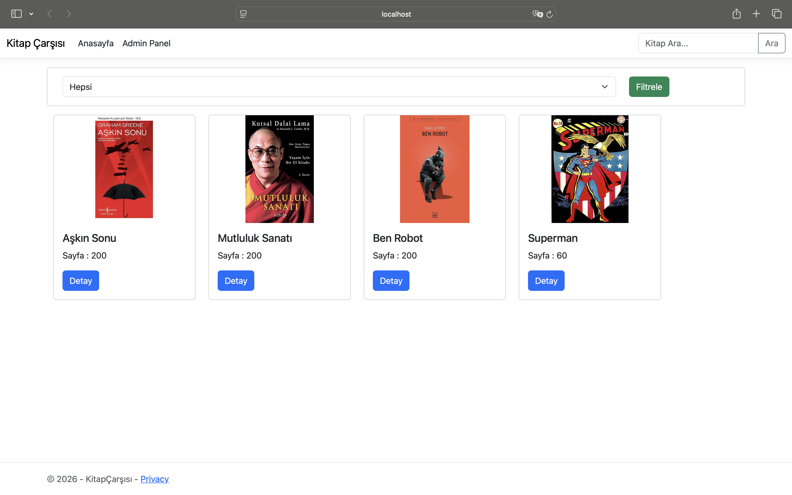
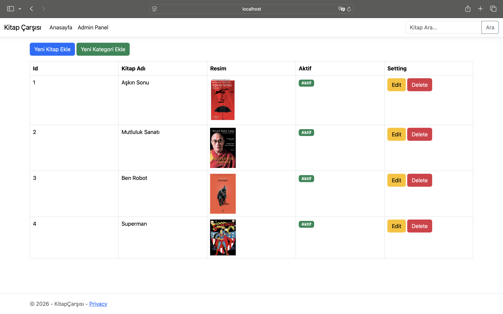
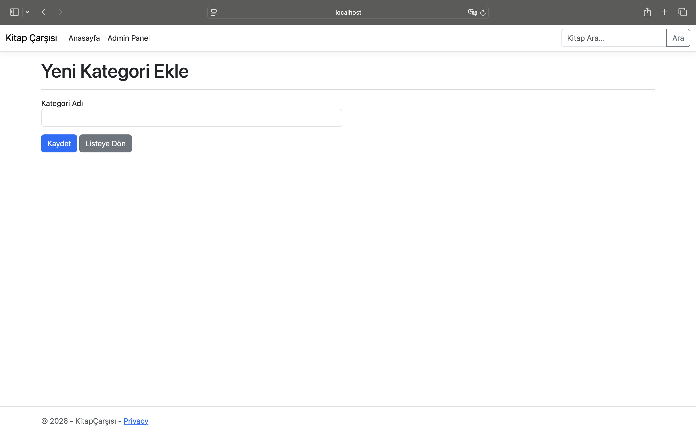
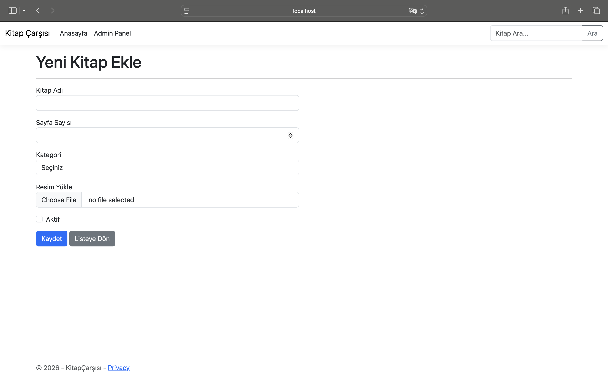

# KitapÇarşısı

KitapÇarşısı, ASP.NET Core MVC mimarisi kullanılarak geliştirilmiş bir kitap yönetim ve listeleme uygulamasıdır. Kullanıcılar kitapları inceleyebilir, arayabilir ve admin paneli üzerinden kitap/kategori yönetimi yapabilirler.

## Özellikler

- **Anasayfa:** Aktif kitapların listelenmesi.
- **Arama ve Filtreleme:** Kitap ismine göre arama ve kategorilere göre filtreleme özelliği.
- **Detay Görüntüleme:** Kitapların fiyat, sayfa sayısı ve özet bilgilerinin görüntülendiği detay sayfası.
- **Admin Paneli:**
  - Kitap Ekleme (Resim yükleme özelliği ile)
  - Kitap Düzenleme
  - Kitap Silme
  - Kategori Ekleme
  - Pasif/Aktif durum yönetimi

## Teknolojiler

- **Platform:** .NET Core
- **Dil:** C#
- **Web Framework:** ASP.NET Core MVC
- **Veri Yönetimi:** In-Memory Repository Pattern (Statik listeler)
- **Tasarım:** Bootstrap 5

## Kurulum

Projeyi çalıştırmak için bilgisayarınızda .NET SDK yüklü olmalıdır.

1. Proje dizinine gidin:
   ```bash
   cd BookApp
   ```

2. Uygulamayı başlatın:
   ```bash
   dotnet watch run
   ```

## Notlar

- Veri tabanı kullanılmamıştır, veriler uygulama çalıştığı sürece bellekte tutulur. Uygulama yeniden başlatıldığında veriler sıfırlanır.
- Yüklenen resimler `wwwroot/img` klasöründe saklanır.

## Ekran Görüntüleri

### Proje Ekran Görüntüleri





